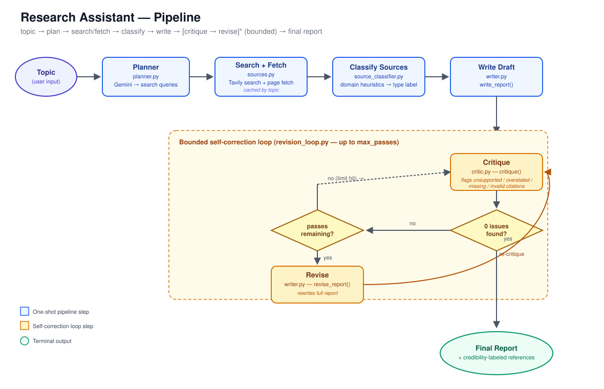

# 🔎 Research Assistant

A research agent that plans searches, gathers real web sources, writes a fully-cited
report, then **critiques its own draft against the source material** and revises —
repeating in a bounded, convergence-tracked loop until no issues remain (or a pass
limit is hit).

Every source is labeled by credibility type (academic/journal, news, blog/company,
social media), and the critic applies extra scrutiny to claims backed by
lower-credibility sources. The whole pipeline is validated by an automated evaluation
harness across a fixed set of topics — not just spot-checked on one example.



📊 **[Demo Presentation (PowerPoint)](docs/Research_Assistant_Demo.pptx)** — covers the
problem, architecture, all three features, measured results, and roadmap.

## Features

- **Bounded self-correction loop** — write → critique → revise, up to `max_passes`,
  stopping early the moment a critique pass finds zero issues. Tracks the full
  convergence trace (e.g. `3 → 1 → 0`), not just pass/fail.
- **Automated evaluation harness** — runs the pipeline over 15 fixed, deliberately
  varied topics and logs issue counts, issue types, convergence, and source mix per
  topic, with a resumable, crash-safe `results.json`.
- **Source credibility awareness** — every source is classified (academic/journal,
  news, blog/company, social media) via domain heuristics, surfaced in the report's
  references, and factored into the critic's scrutiny.
- **Model performance logging** — every report generation logs real token usage and
  call counts to a running `metrics_log.jsonl`, so swapping the writer/critic model
  later can be compared against accumulated historical data.
- **Debug mode** — a checkbox in the UI reveals the raw planner output and every
  search result Tavily returned per query, including ones that were skipped during
  fetch.
- **Reliability engineering** — truncation-safe generation (retries with a larger
  token budget instead of silently returning cut-off text), disk-backed caching of
  every LLM/search call (saves API quota and search credits on reruns), and
  per-topic error isolation in the eval harness.

## Measured results

From a 15-topic evaluation run (`max_passes=3`):

| Metric | Value |
|---|---|
| Topics evaluated | 15 / 15 succeeded |
| Avg issues in first draft | 0.87 |
| Converged to zero issues | 86.7% |
| Converged within 2 passes | 66.7% |
| Total issues flagged | 24 (12 unsupported, 12 overstated) |
| Source mix | 111 blog/company, 48 academic/journal, 6 social, 5 news |

See `results.json` (generated by `eval_harness.py`) for the full per-topic breakdown.

## Architecture

```
topic → Planner → Search + Fetch → Classify Sources → Write Draft
                                                            ↓
                              ┌────────── self-correction loop ──────────┐
                              │  Critique → issues found? ─── no ──→ done │
                              │       ↑                                  │
                              │      yes, passes left → Revise ──────────┘
                              └────────────────────────────────────────
                                                            ↓
                                              Final Report + References
```

| File | Role |
|---|---|
| `planner.py` | Topic → search sub-questions + queries (Gemini). Retries on truncated JSON. |
| `sources.py` | Runs planned queries through Tavily search + page fetch, assigns stable citation ids. Cached by topic. |
| `source_classifier.py` | Domain-heuristic credibility labeling (academic/news/blog/social), no API call. |
| `writer.py` | Synthesizes the cited report (`write_report`) and rewrites it against critic feedback (`revise_report`). |
| `critic.py` | Checks a draft against its sources, flags `unsupported` / `overstated` / `missing_citation` / `invalid_citation` issues. |
| `revision_loop.py` | Orchestrates the bounded write → critique → revise loop and returns the full convergence trace. |
| `cache.py` | Disk cache (by function + argument hash) used by every LLM/search call. |
| `usage_tracker.py` | Records real Gemini token usage per call. |
| `analytics.py` | Builds and logs per-report performance metrics (`metrics_log.jsonl`); summarizes by model. |
| `eval_harness.py` | Runs the pipeline over a fixed topic set, logs results, resumable across interruptions. |
| `app.py` | Streamlit UI — live pipeline run, convergence chart, model performance panel, debug mode. |
| `test_day45.py` | CLI smoke test for quick manual runs outside the UI. |
| `config.py` | API keys and shared constants (model name, min/max planned queries). |

## Setup

**1. Clone and install dependencies**

```bash
git clone <this-repo-url>
cd research-assistant
pip install -r requirements.txt
```

**2. Set API keys**

Create a `.env` file in the project root (excluded from git via `.gitignore`):

```
GEMINI_API_KEY=your-gemini-api-key
TAVILY_API_KEY=your-tavily-api-key
```

See `config.py` for the exact variable names and any other constants (model name,
min/max planned queries, results-per-query) it expects.

**3. Run it**

```bash
# Quick single-topic smoke test
python test_day45.py "impact of large language models on scientific research"

# Live UI (recommended for demos)
streamlit run app.py

# Full evaluation across the fixed topic set
python eval_harness.py
python eval_harness.py --limit 5 --max-passes 2   # cheap smoke test first
python eval_harness.py --topics-file custom.txt   # your own topic list

# Cross-run model performance summary
python analytics.py
```

To force a fresh run bypassing all caches:
```bash
RESEARCH_ASSISTANT_NO_CACHE=1 python test_day45.py "your topic"
```

## Known limitations / honest findings

- **Revision isn't monotonic** — issue counts can rise before falling (observed
  `1 → 2 → 2` in testing). This is why the loop is bounded and tracked rather than
  assumed to always improve after one pass.
- **Some topics plateau** — ~13% of evaluated topics hit the pass limit without
  reaching zero issues; the loop can stall on a persistent issue type.
- **Writer and critic currently share one model** — the critic is isolated behind a
  single function boundary (`critique()`) specifically so a second, independent
  model could be swapped in later without touching the rest of the pipeline.
- **Source classification is heuristic, not exhaustive** — domain-pattern matching
  defaults unrecognized domains to `blog/company`; an optional (currently unused)
  LLM-based fallback exists in `source_classifier.py` for ambiguous cases.

## Roadmap

- [ ] Independent critic model (different provider/model than the writer)
- [ ] Claim-level traceability in the UI — click a citation, see the exact source excerpt
- [ ] Source-credibility-weighted issue rate, measured at scale
